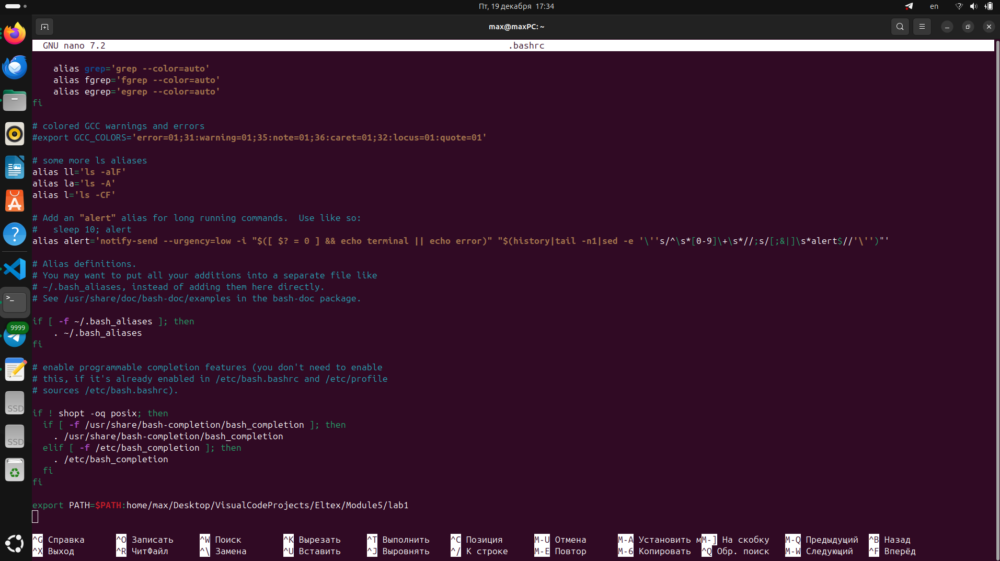
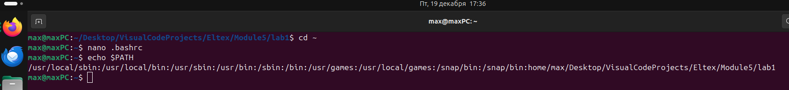
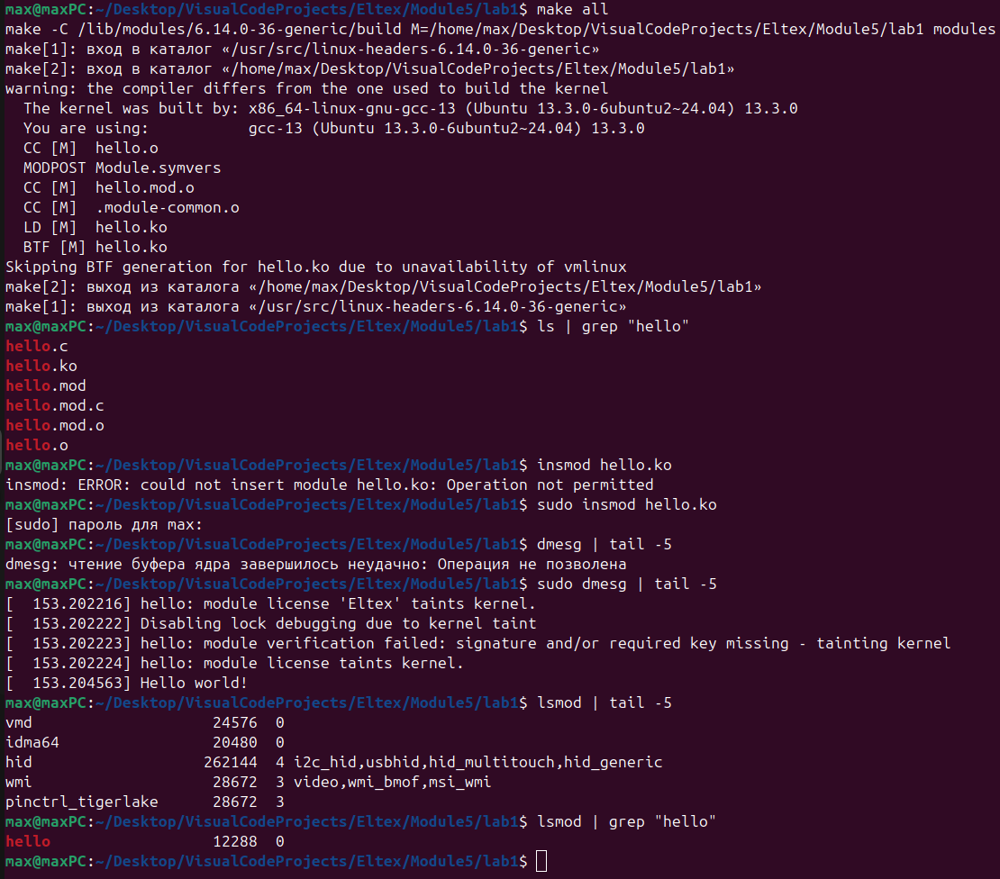
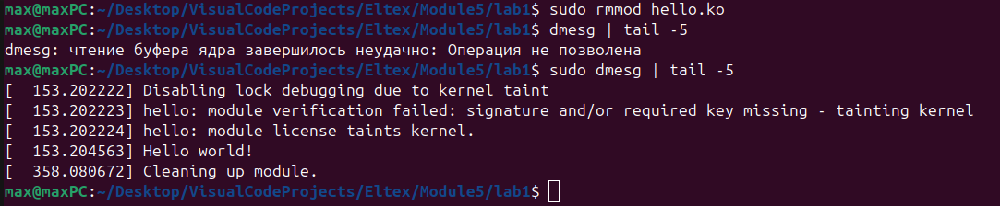
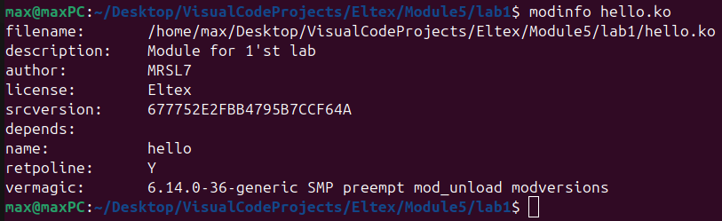

<h1>1. Вставка папки проекта в PATH:</h1>

<h1>2. Проверка переменной PATH:</h1>

<h1>3. Компиляция и вставка модуля ядра. Проверка через dmesg и lsmod:</h1>

<h1>4. Удаление модуля ядра. Проверка через dmesg:</h1>

<h1>5. Просмотр информации о модуле ядра через modinfo:</h1>

